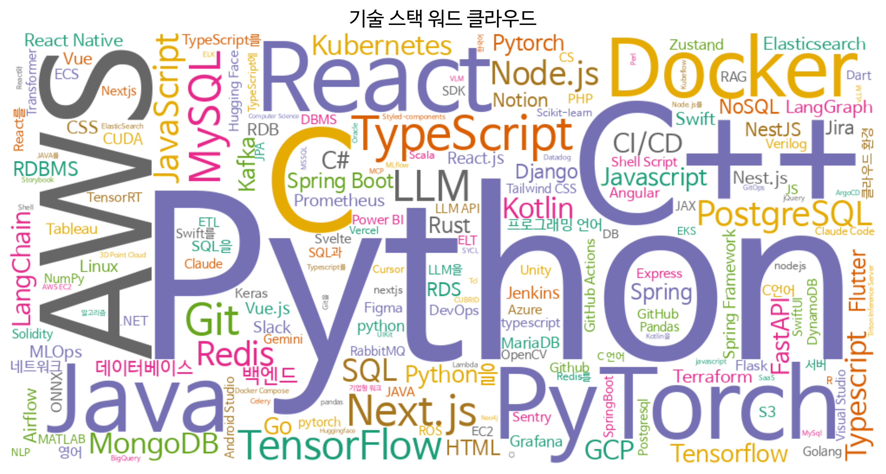
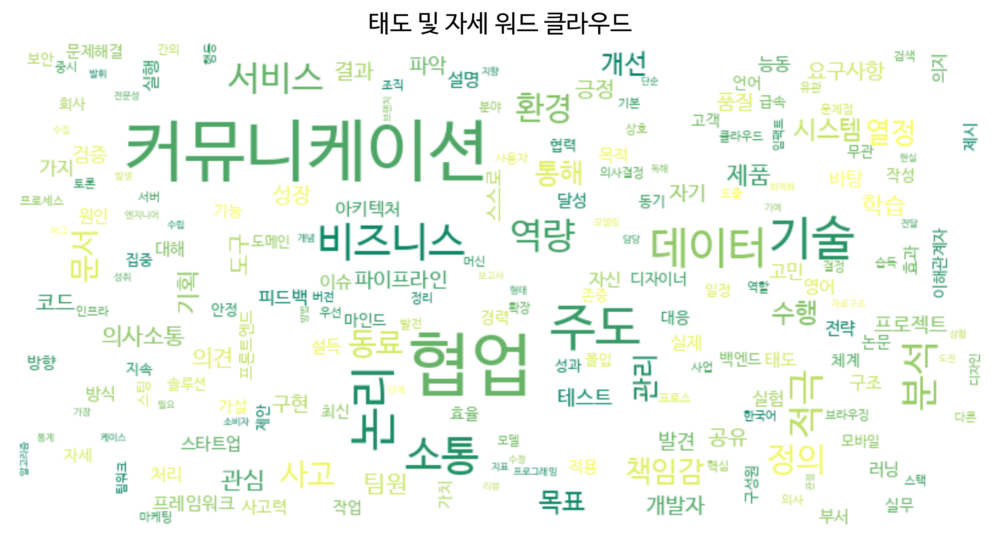

# 📊 채용공고 및 기업 리뷰 기반 IT 직군 역량 분석

> **인하공업전문대학 컴퓨터정보공학과 빅데이터 프로젝트** > **과목**: 빅데이터 프로젝트 (3학년 B반)  
> **학번/이름**: 202144051 김선재  
> [cite_start]**프로젝트 기간**: 2024.09 ~ 2024.12 [cite: 1-4]

---

## 📑 목차
1. [서론 (Introduction)](#1-서론-introduction)
2. [개발 환경 (Environment)](#2-개발-환경-environment)
3. [데이터 수집 (Data Collection)](#3-데이터-수집-data-collection)
4. [데이터 전처리 및 분석 (Data Processing)](#4-데이터-전처리-및-분석-data-processing)
5. [데이터 시각화 (Visualization)](#5-데이터-시각화-visualization)
6. [결론 (Conclusion)](#6-결론-conclusion)

---

## 1. 서론 (Introduction)

### 1.1 주제 선정 이유
대학 졸업 시기가 다가오면서 취업에 대한 고민이 깊어졌습니다. 막연히 스펙을 쌓기보다, 실제 기업의 채용 공고를 분석하여 **현재의 기술 트렌드**와 **기업이 요구하는 인재상**을 데이터 기반으로 명확히 파악하고자 이 주제를 선정했습니다.

### 1.2 프로젝트 설정
* **분석 대상**: 채용 정보 사이트 **'원티드(Wanted)'** (텍스트 위주 구성으로 크롤링 용이)
* **분석 범위**:
    * 직군: 개발 직군 전체
    * 경력: 신입 및 경력 1년 미만
    * 지역: 서울, 인천, 경기도
* **프로세스**: 데이터 수집 → 정제 및 가공 → 분석(NLP) → 시각화


---

## 2. 개발 환경 (Environment)

Google Colab 환경에서 진행하였으며, 크롤링 및 텍스트 분석을 위해 `Selenium`, `GLiNER`, `KoNLPy` 등의 라이브러리를 사용했습니다.

### 2.1 라이브러리 및 Chrome 설치
Colab의 기본 Chrome은 보안 문제로 실행되지 않아, Google에서 배포하는 Stable 버전을 직접 설치하여 사용했습니다.

```bash
# 일반 크롬 브라우저는 보안 문제로 오류 발생. 구글에서 직접 내려 받음
%%shell
sudo apt-get update
sudo apt-get install -y wget unzip

wget [https://dl.google.com/linux/direct/google-chrome-stable_current_amd64.deb](https://dl.google.com/linux/direct/google-chrome-stable_current_amd64.deb)
sudo dpkg -i google-chrome-stable_current_amd64.deb
sudo apt-get -f install -y  # 의존성 오류 발생시 자동 수정

google-chrome --version

# 한글 폰트 설치
!apt-get -qq -y install fonts-nanum > /dev/null

# 필요 라이브러리 설치
!pip install selenium
!pip install selenium webdriver_manager
!pip install gliner
!pip install konlpy

!apt-get update
```

### 2.2 Import 및 폰트 설정
```python
import re
import time
import pandas as pd
import seaborn as sns
import matplotlib.pyplot as plt
import matplotlib.font_manager as fm
from wordcloud import WordCloud
from collections import Counter
from konlpy.tag import Okt
from tqdm import tqdm
from gliner import GLiNER
from bs4 import BeautifulSoup
from selenium import webdriver
from selenium.webdriver.chrome.options import Options
from selenium.webdriver.chrome.service import Service
from webdriver_manager.chrome import ChromeDriverManager
from selenium.webdriver.common.by import By

# 폰트 설정 (나눔고딕)
fe = fm.FontEntry(
    fname=r'/usr/share/fonts/truetype/nanum/NanumBarunGothic.ttf',
    name='NanumGothic')
fm.fontManager.ttflist.insert(0, fe)
plt.rcParams.update({'font.size': 18, 'font.family': 'NanumGothic'})
```

---

## 3. 데이터 수집 (Data Collection)

### 3.1 봇 탐지 우회 설정 (Stealth Mode)
Selenium을 이용한 자동화 탐지를 피하기 위해 다음과 같은 설정을 적용했습니다.
1.  **Headless 모드**: GUI 없이 백그라운드 실행 (리소스 절약)
2.  **User-Agent 변경**: 봇이 아닌 일반 윈도우 10 사용자처럼 위장
3.  **Automation Flag 제거**: 자동화 도구 사용 흔적 제거
4.  **WebDriver 속성 조작**: `navigator.webdriver` 값을 `undefined`로 강제 설정하여 봇 탐지 스크립트 무력화

```python
# 옵션 설정
options = Options()
options.add_argument("--headless=new")
options.add_argument("--no-sandbox")
options.add_argument("--disable-dev-shm-usage")
options.add_argument("--window-size=1920,1080")

# User-Agent 위장
user_agent = "Mozilla/5.0 (Windows NT 10.0; Win64; x64) AppleWebKit/537.36 (KHTML, like Gecko) Chrome/120.0.0.0 Safari/537.36"
options.add_argument(f'user-agent={user_agent}')

# 자동화 제어 메시지 제거
options.add_experimental_option("excludeSwitches", ["enable-automation"])
options.add_experimental_option('useAutomationExtension', False)
options.add_argument('--disable-blink-features=AutomationControlled')

# 드라이버 실행
service = Service(ChromeDriverManager().install())
driver = webdriver.Chrome(service=service, options=options)

# 봇 탐지 방지용 스크립트 실행 (navigator.webdriver = undefined)
driver.execute_cdp_cmd("Page.addScriptToEvaluateOnNewDocument", {
    "source": """
    Object.defineProperty(navigator, 'webdriver', {
      get: () => undefined
    })
  """
})
```

### 3.2 링크 수집 및 상세 내용 크롤링
타겟 URL에 접속하여 스크롤을 내리며 공고 링크를 수집하고, `set`을 이용해 중복을 제거했습니다. 이후 각 페이지에서 **제목, 회사명, 주요업무, 자격요건, 우대사항**을 추출했습니다.

```python
# 링크 수집
print(" 채용공고 링크 수집 시작 ")
target_url = "[https://www.wanted.co.kr/wdlist/518?country=kr&job_sort=job.latest_order&years=0&years=1&employment_types=job.employment_type.regular&employment_types=job.employment_type.contract&locations=seoul.all&locations=incheon.all&locations=gyeonggi.all](https://www.wanted.co.kr/wdlist/518?country=kr&job_sort=job.latest_order&years=0&years=1&employment_types=job.employment_type.regular&employment_types=job.employment_type.contract&locations=seoul.all&locations=incheon.all&locations=gyeonggi.all)"
driver.get(target_url)
time.sleep(3)

# 스크롤을 내려 확보할 데이터 양 결정
for i in range(30):
    driver.execute_script("window.scrollTo(0, document.body.scrollHeight);")
    time.sleep(2)

# 링크 추출 및 중복 제거
all_links = driver.find_elements(By.TAG_NAME, "a")
job_links = []
for a in all_links:
    href = a.get_attribute("href")
    if href and "/wd/" in href:
        job_links.append(href)
job_links = list(set(job_links))
print(f" 총 {len(job_links)}개의 공고 링크를 확보 ")

# 상세 페이지 크롤링
final_data = []

for link in tqdm(job_links):
    try:
        driver.get(link)
        time.sleep(2)
        soup = BeautifulSoup(driver.page_source, 'html.parser')

        # 제목 추출
        try: title = soup.find("h1").text
        except: title = ""

        # 회사명 추출 (링크 기반)
        try:
            company_link = soup.select_one("a[href^='/company/']")
            company = company_link.text if company_link else ""
        except: company = ""

        # 본문 내용 추출 함수
        def get_text_by_header(target_text):
            headers = soup.find_all(['h3', 'h2', 'strong'], string=lambda x: x and target_text in x)
            result_text = ""
            for h in headers:
                next_elem = h.find_next_sibling()
                if next_elem:
                    result_text += next_elem.get_text(separator=" ", strip=True)
            return result_text

        main_work = get_text_by_header("주요업무")
        qualification = get_text_by_header("자격요건")
        preference = get_text_by_header("우대사항")

        if title:
            final_data.append({
                'company': company, 'title': title, 'main_work': main_work,
                'qualification': qualification, 'preference': preference, 'link': link
            })
    except Exception as e: continue

df = pd.DataFrame(final_data)
df.to_csv("wanted_job_data.csv", encoding="utf-8-sig", index=False)
```

---

## 4. 데이터 전처리 및 분석 (Data Processing)

수집된 텍스트 데이터를 **기술 스택(Tech Stack)**과 **역량(Soft/Hard Skills)**으로 분류하여 분석했습니다.

### 4.1 기술 스택 추출 (with GLiNER)
트렌드가 빠르게 변하는 기술 스택은 사전 학습된 AI 모델인 **GLiNER**를 사용하여 문맥 내에서 엔티티를 추출했습니다.

```python
# 모델 로드
model = GLiNER.from_pretrained("urchade/gliner_medium-v2.1")

# 텍스트 통합
df['full_text'] = (df['main_work'].fillna('') + ' ' + df['qualification'].fillna('') + ' ' + df['preference'].fillna(''))

# 기술 스택 추출 함수
def extract_tech_stack(text, model):
    if not isinstance(text, str) or len(text) < 5: return ""
    
    tech_labels = ["Programming Language", "Framework & Library", "Database & Tool", "Cloud & DevOps", "AI & Data Stack"]
    entities = model.predict_entities(text, tech_labels, threshold=0.3)
    
    found_techs = [entity["text"] for entity in entities]
    return ', '.join(sorted(list(set(found_techs))))

# 적용
df['Tech_Stack'] = df['full_text'].progress_apply(extract_tech_stack, args=(model,))
```

### 4.2 소프트/하드 스킬 분류 (Rule-based)
역량 키워드는 정형화되어 있으므로, 키워드 사전과 정규표현식(문장 끝맺음 패턴)을 활용하여 추출했습니다.

```python
# 소프트/하드 스킬 분류 함수
def extract_soft_hard_skill(text):
    if not isinstance(text, str): return "", ""
    
    sentences = re.split(r'[.\n•·-]', text)
    sentences = [x.strip() for x in sentences if len(x.strip()) > 5]
    
    soft_skills, hard_skills = [], []
    
    # 키워드 사전 (일부 생략)
    tech_keyword = ['설계', '구축', '운영', 'AWS', 'API', 'DB', '트래픽' ...]
    soft_keyword = ['커뮤니케이션', '소통', '협업', '주도', '책임', '성장' ...]
    
    for sent in sentences:
        # 문장 끝맺음 확인 (~분, ~능력 등)
        if not re.search(r'(분|함|력|험|해|식|가능|필수|우대|중시)$', sent): continue
        
        is_hard = any(t in sent for t in tech_keyword)
        is_soft = any(t in sent for t in soft_keyword)
        
        if is_soft: soft_skills.append(sent)
        elif is_hard: hard_skills.append(sent)
            
    return " | ".join(soft_skills), " | ".join(hard_skills)

df[['Soft_Skills', 'Hard_Skills']] = df['full_text'].progress_apply(lambda x: pd.Series(extract_soft_hard_skill(x)))
```

---

## 5. 데이터 시각화 (Visualization)

추출된 데이터의 빈도수를 분석하고 **막대 그래프**와 **워드 클라우드**로 시각화했습니다. 정확한 분석을 위해 `KoNLPy`를 이용한 명사 추출과 불용어 처리를 수행했습니다. 

### 5.1 시각화 코드
```python
# 텍스트 정제 및 명사 추출 함수
def extract_keywords_from_sentences(column_data, stop_words):
    all_keywords = []
    for text in column_data.fillna(""):
        sentences = text.split('|')
        for sent in sentences:
            if not sent.strip(): continue
            nouns = okt.nouns(sent)
            # 불용어 제거 및 2글자 이상 단어만 선택
            clean_nouns = [n for n in nouns if n not in stop_words and len(n) >= 2]
            all_keywords.extend(clean_nouns)
    return all_keywords

# 시각화 함수 (Bar Plot & Word Cloud)
def visualize_top_skills(keywords, title, text, color_palette='viridis'):
    if not keywords: return
    
    count_data = Counter(keywords)
    df_freq = pd.DataFrame(count_data.most_common(20), columns=['Keyword', 'Frequency'])
    
    # 막대 그래프
    plt.figure(figsize=(12, 6))
    sns.barplot(x='Frequency', y='Keyword', data=df_freq, palette=color_palette)
    plt.title(f'{title} 빈도 TOP 20')
    plt.savefig(f"{text}_bargraph.png", dpi=300)
    plt.show()
    
    # 워드 클라우드
    wc = WordCloud(width=800, height=400, background_color='white',
                   font_path='/usr/share/fonts/truetype/nanum/NanumBarunGothic.ttf',
                   colormap='coolwarm' if 'Hard' in title else 'summer')
    wc.generate_from_frequencies(count_data)
    
    plt.figure(figsize=(10, 5))
    plt.imshow(wc, interpolation='bilinear')
    plt.axis('off')
    plt.savefig(f"{text}_wordcloud.png", dpi=300)
    plt.show()
```

### 5.2 분석 결과
* **기술 스택**: **Python**이 가장 많았으며, AI 트렌드에 따라 **PyTorch, TensorFlow**가 상위권에 위치했습니다. [cite_start]웹 개발에서는 **React, Java, Node.js**가, 인프라에서는 **AWS, Docker, Git**이 필수적이었습니다.
* **태도(Soft Skills)**: '협업', '커뮤니케이션', '소통'이 가장 중요하게 나타났으며, '주도적', '적극적' 성향을 선호하는 것으로 분석되었습니다.




---

## 6. 결론 (Conclusion)

본 프로젝트를 통해 IT 채용 시장에서 **Python과 AI 기술의 중요성**을 데이터로 확인했습니다. 취업을 위해서는 단순히 코딩 실력뿐만 아니라 **AWS/Docker/Git을 활용한 개발 환경 구축 능력**, 그리고 팀원과 원활하게 **소통하고 협업하는 태도**를 갖추는 것이 핵심임을 알 수 있었습니다.
